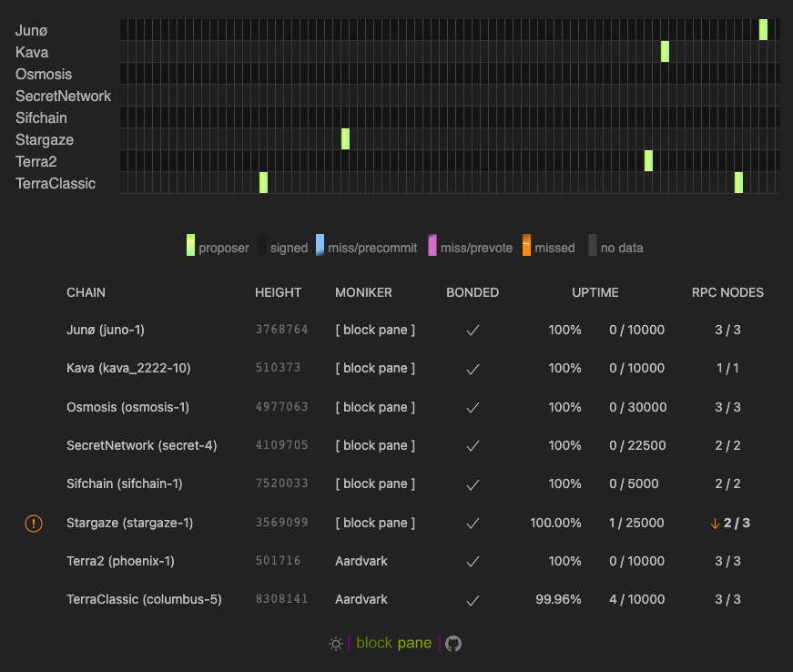

# Tenderduty Docs

### What is tenderduty?

This is a tool for validators running tendermint nodes. It sends notifications when it detects problems.

## Detailed Documentation Topics

- [Installation](install.md)
- [Configuration File Settings](config.md)
- [Setting up PagerDuty](pagerduty.md)
- [Setting up Discord](discord.md)
- [Setting up Telegram](telegram.md)
- [Prometheus Exports](prometheus.md)
- [Remotely Configuring Tenderduty](remote.md)
- [Running on Akash](akash.md)

## What does it do?

Monitors a validator's performance across multiple chains

- The main purpose of tenderduty is to monitor consensus state, and alert if the validator is missing blocks. This can be based on consecutive misses or on a percentage missed within the slashing window.
- Alerting if jailed, tombstoned, or inactive.
- Alert destinations can be customized for each chain.
- Monitors node health:
    * Optional alerting if syncing or not responding.
    * Configurable threshold to wait before alerting on downtime
- If no nodes are alive it can fallback to using public RPC nodes.

Provides a prometheus exporter for integration with other visualization systems. 
Sends an alert to any of three destinations: Pagerduty, Discord, or Telegram.

A dashboard for displaying status.

- The missed block grid was heavily influenced by the uptime display on [ping.pub](https://ping.pub). *Many thanks for the inspiration!*
- The last 512 blocks are displayed on the status grid.
- Displays a table showing validator and node status.
- Designed intentionally for maximum density for validators on a lot of chains.
- Dark/light display modes.
- Optionally shows a real-time stream of log messages with details about ongoing health checks.

## System Requirements:

* CPU: minimum of 1 core
* Memory: 128MB minimum, 256MB strongly recommended for containers.
* Bandwidth: 
  * Inbound: ~500KiB/s per-validator. Ex: monitoring 16 validators consumes 8MiB/s inbound.
  * Outbound: negligible, ~5-10 KiB/s per validator.
* Storage: ~60MB for the Docker container, ~35MB for binary alone. The cache file should be only a few KB.

## How does it work?

For each chain being monitored:

* Sets up an RPC client
  - On the initial connection it will get the validators consensus key and convert to a valcons bech32 address.
  - Occasionaly checks for validator state: active, jailed, tombstoned
  - Checks for a count of missed blocks within the jailing window.
* Uses a websocket to subscribe to NewBlock and Vote events.
  - The votes are used to determine if a pre-vote/pre-commit was sent by the validator.
  - The finalized blocks are checked for the validator's signature.
* Once/minute checks the health of all nodes by creating a new RPC client and getting the status.
* If all configured nodes are down it can use the [cosmos.directory](https://cosmos.directory) to locate a public RPC node.

Dashboard:

* The dashboard provides a stream of missed block and validator status information over a websocket
* Missed blocks are displayed on a grid. This grid uses different colors to represent the validator's consensus state
  * Signed blocks aren't highlighted. This should be the nominal state.
  * Missed blocks are bright orange.
  * Not all missed blocks are the same. It is useful to know if a validator sent a pre-commit or even a pre-vote and was not included in the block. This might indicate peering issues, or even that another validator is having problems and missing pre-commits from others.
  * Bright green/yellow is used to indicate a block the validator proposed.
  * *todo: There is one additional state that could be added. It would be useful to have an indicator when the validator was intended to be the proposer and timed out.*

Notifications:

* There really isn't anything special about the notifications it sends. For Discord and Telegram it will only send an alert on a new alarm and when the alarm clears. Pagerduty has a little more nuance.
* Pagerduty:
  * Pro-tip: the alarms sent to pagerduty all use a unique "key". Pagerduty will automatically de-deduplicate alerts based on this key. If you want redundant monitoring you can run multiple instances of tenderduty alerting to pagerduty and will not get duplicate alerts.
  * Additional flapping detection is applied to pagerduty (not to discord or telegram). If a node is going up and down every few minutes it will only send an alert once in a five minute period.
