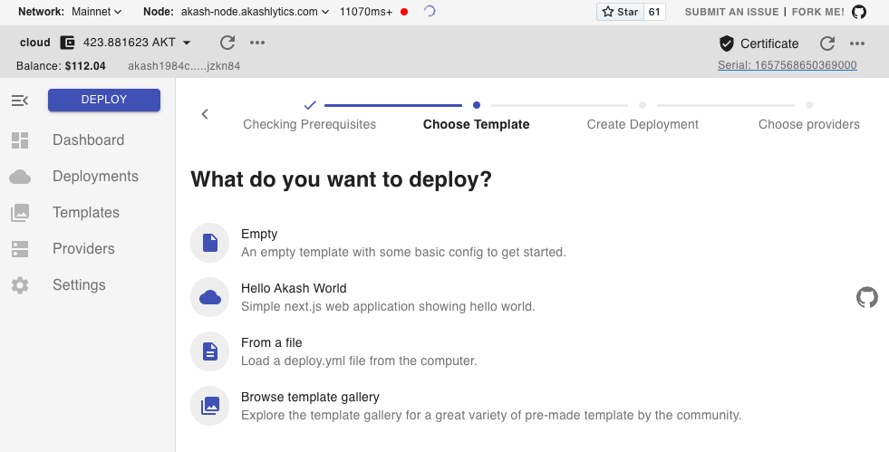
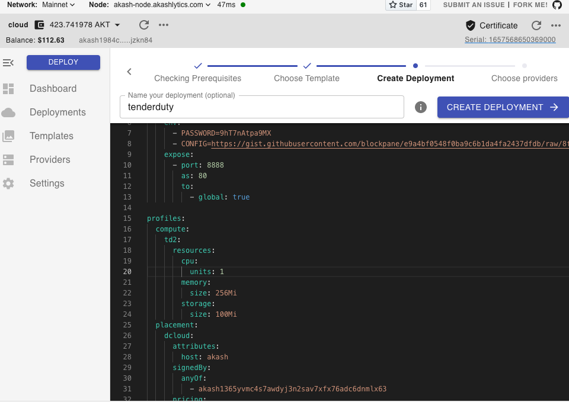
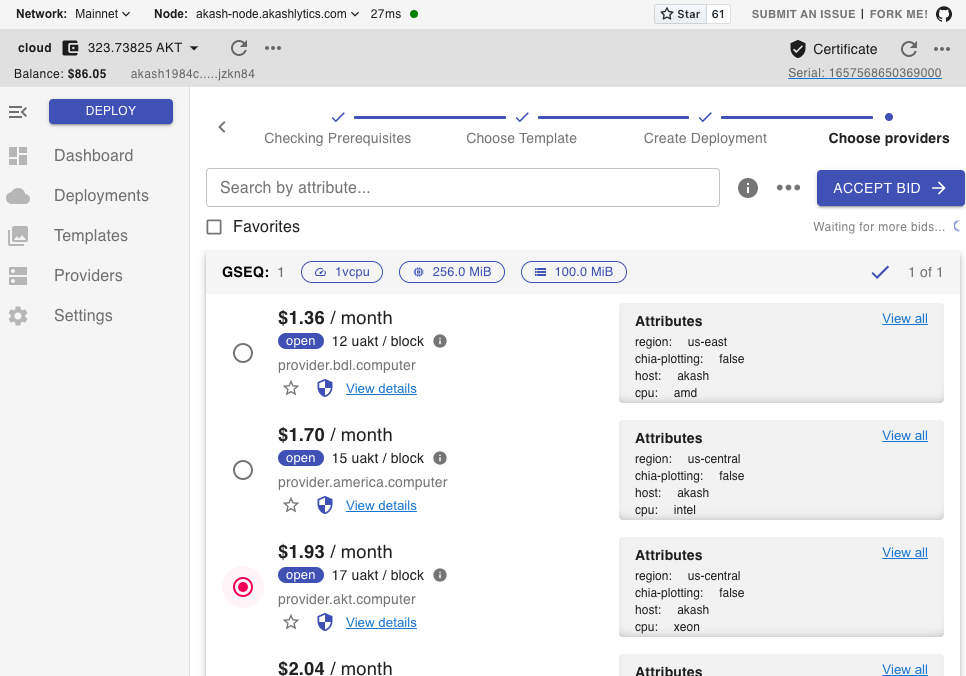
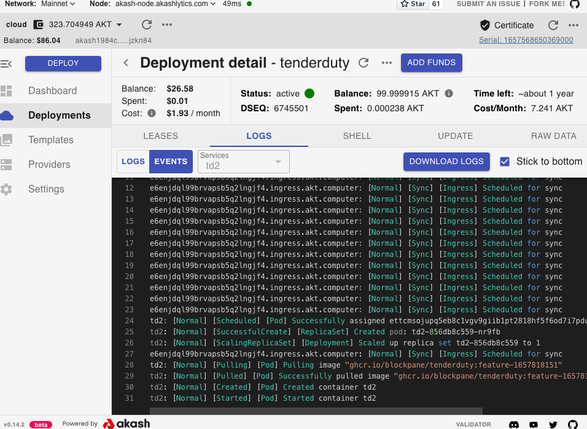
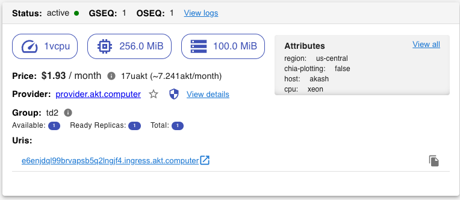
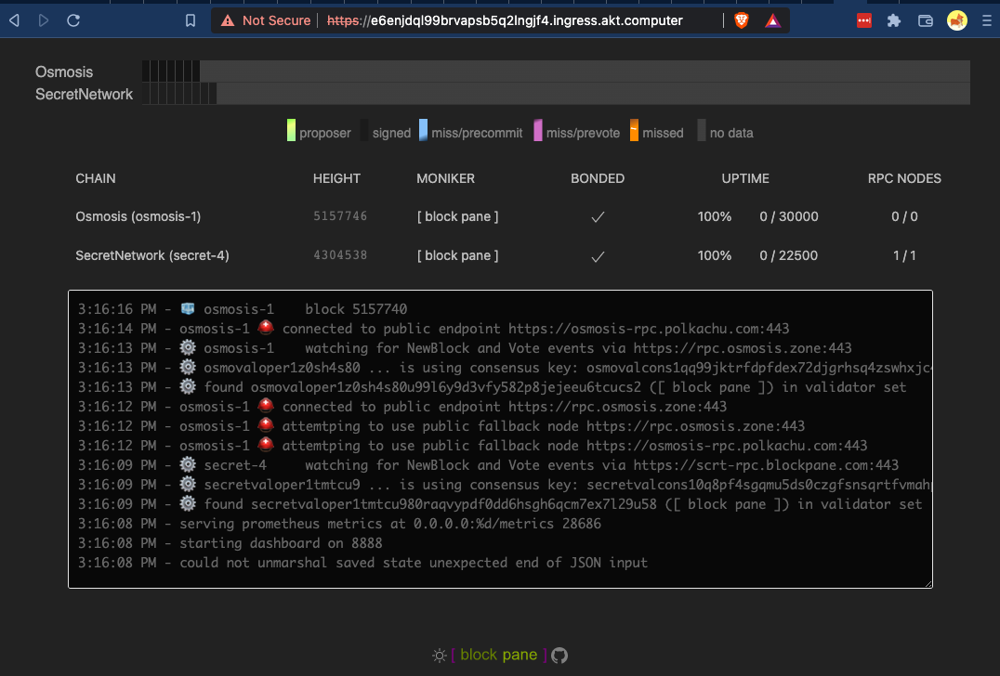

# Example Akash Deployment

[Akash](https://akash.network/) is an affordable and easy way to get tenderduty up and running for about $2 USD per month.

Steps:

* First, you will need to create, configure, and encrypt your configuration file. See the [Remote](remote.md) documentation for how to encrypt the file. *It's a good idea to test the configuration with a local Docker container before deploying.*
* You will need to create a key and acquire some [$AKT](https://docs.akash.network/tokens-and-wallets) tokens.
* The easiest way to deploy is using the [Akash desktop app](https://docs.akash.network/guides/deploy)

In the dashboard click on 'Create Deployment', then select 'Empty'



Paste in the configuration and click 'Create Deployment', you will be prompted to sign a transaction.



Below is an example config, don't forget to update the PASSWORD and CONFIG variables. 

*Tip: using the raw link to a private Github gist is a handy way to host the config, but will require updating the CONFIG variable and re-deploying each time the config file changes.*

```yaml
---
version: "2.0"

services:
  td2:
    image: ghcr.io/blockpane/tenderduty:feature-1657833932
    env:
      - PASSWORD=<key-to-decrypt>
      - CONFIG=https://host.name/config.yml.asc
    expose:
      - port: 8888
        as: 80
        to:
          - global: true

profiles:
  compute:
    td2:
      resources:
        cpu:
          units: 1
        memory:
          size: 256Mi
        storage:
          size: 100Mi
  placement:
    dcloud:
      attributes:
        host: akash
      signedBy:
        anyOf:
          - akash1365yvmc4s7awdyj3n2sav7xfx76adc6dnmlx63
      pricing:
        td2:
          denom: uakt
          amount: 1000

deployment:
  td2:
    dcloud:
      profile: td2
      count: 1

```

If the transaction is successful, you will get a few bids. Select one and press 'Accept Bid'.



Once the bid has been accepted the application will change to the deployments screen showing the event log for the pod. Once it shows it as deployed the tenderduty application should be up and running.



You can get the hostname for the deployment on the deployments screen by selecting your deployment.



If you made it this far, congrats!

