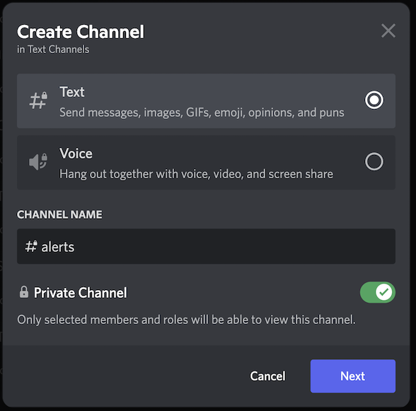
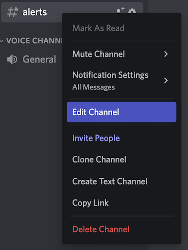
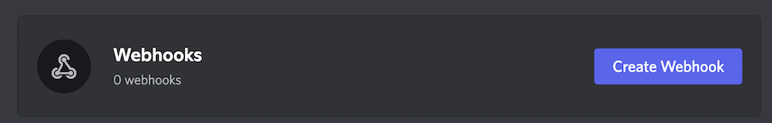
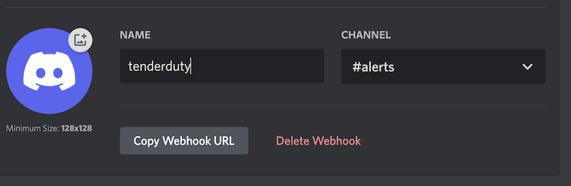

# Discord Configuration

Configuring a Discord webhook is very easy. 

* First create a channel:

* Then add members, or skip. Once the channel is created, right click on the channel and select "edit channel", then select "Integrations"

* Create a webhook, give it a name, copy the URL, and save it.

* Now the webhook URL can be used in the config.yml for alerts.
