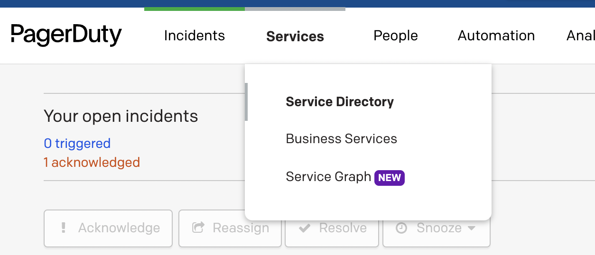
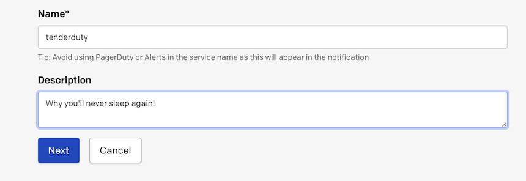
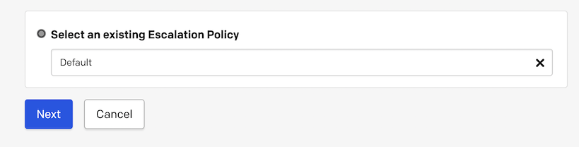
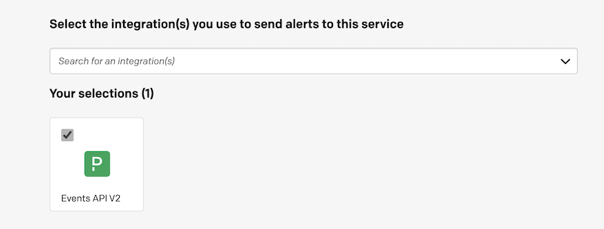
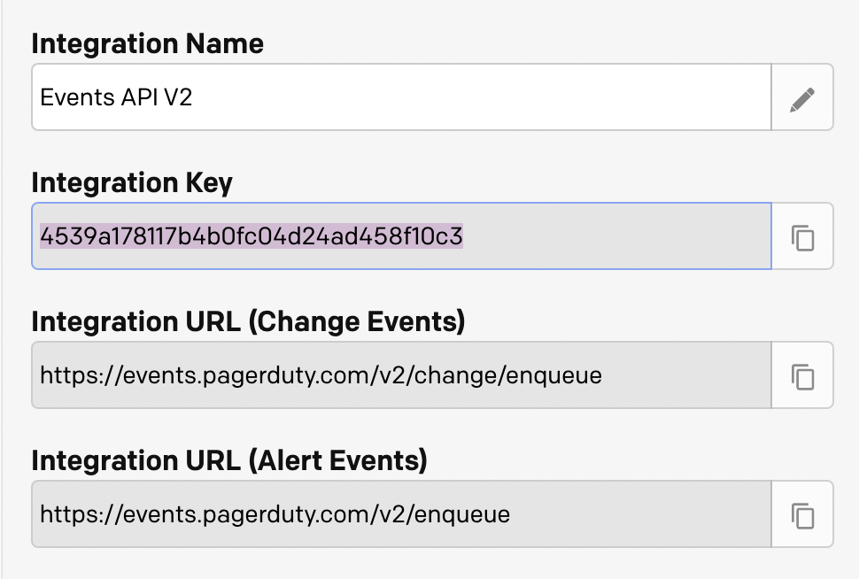

# Pagerduty configuration

The Pagerduty application offers two types of keys that can access their API. Tenderduty uses an API key, not an OAuth key. It will detect that it has been provided an OAuth key at startup and refuse to start. Here is how to get the correct type of key:

## To generate your pagerduty integration key

- Within PagerDuty, go to Services --> Service Directory --> New Service

- Give your service a name, select an escalation policy, and set an alert grouping preference

- Select the PagerDuty Events API V2 Integration, hit Create Service

- Copy the 32 character `Integration Key` into the config.yml file
